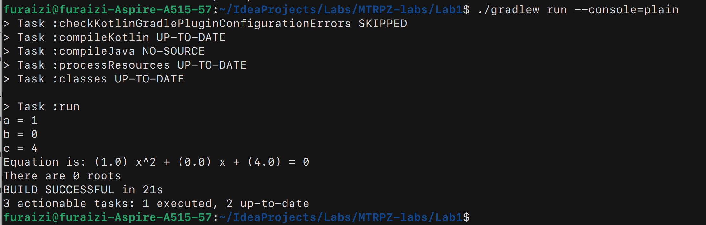
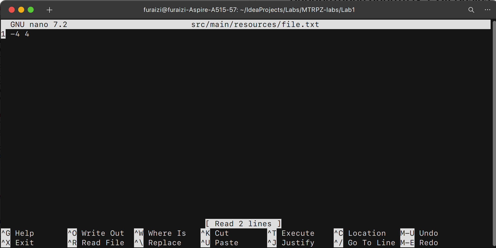
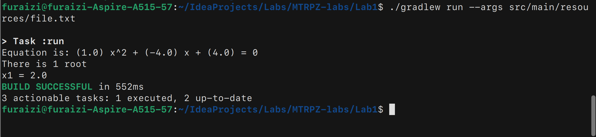

# Лабораторна робота №1. Git Basics

## Мета
Продемонструвати базові навички роботи з системою контролю версій Git

## Короткий опис програми  
Це консольна програма для вирішення квадратних рівнянь.  
Доступно 2 режими:
- **Інтерактивний**: програма у консольному вікні пропонує вам ввести коефіцієнти рівняння, після чого виводить інформацію про рівняння та його розв'язки.
- **Неінтерактивний**: користувач через аргументи командного рядка передає шлях до файлу, в якому міститься рядок з коефіцієнтами рівняня, після чого програма виводить інформацію про рівняння та його розв'язки.

## Демонстрація роботи програми
- **Інтерактивний режим**


- **Неінтерактивний режим**  
    - Зміст файлу
      
    - Робота режиму
    


## Формат файлу для неінтерактивного режиму
a b c  
  
**Наприклад**:  
для рівняння x^2 - 7x + 10 формат буде наступниим  
1 -7 10

## Як запустити проєкт

### Пререквізити
Для того, щоб запустити програму, ви попередньо маєте встановити:
- JDK 21 or newer
- Gradle

### Встановлення

1. Склонуйте репозиторій
```
git clone https://github.com/furaizi/MTRPZ-lab-1.git
cd MTRPZ-lab-1
```

2. Запустіть програму
- Зайти у інтерактивний режим
```
./gradlew run --console=plain
```

- Зайти у неінтерактивний режим
```
./gradlew run --args=<шлях до файлу>
```

4. Насолоджуйтесь :)

## [Посилання на revert commit](https://github.com/furaizi/MTRPZ-lab-1/commit/093b9f2a413a6c1c1ffd0b9c208952d209a5cf33)

